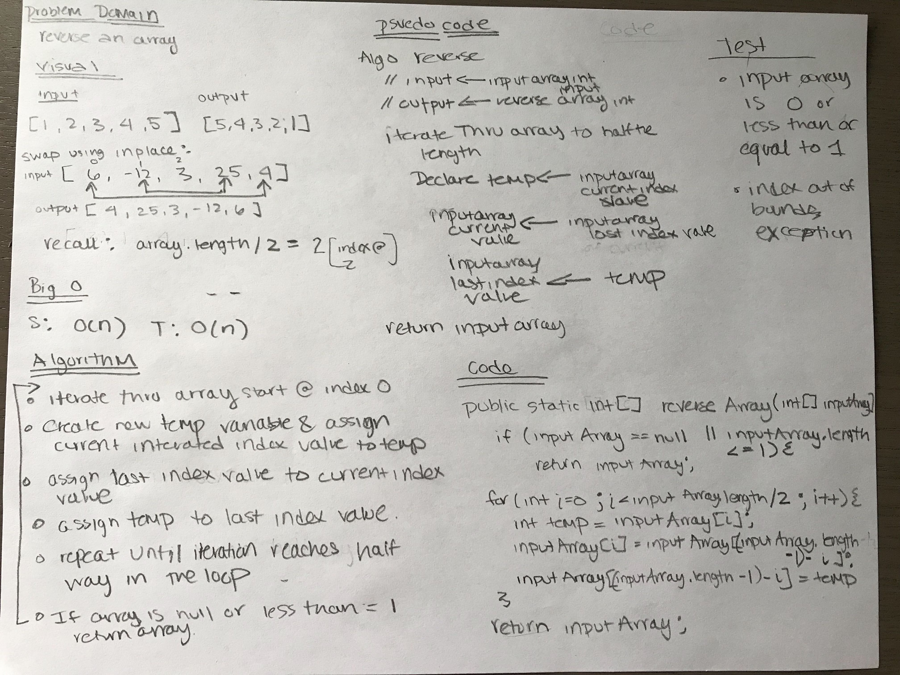

# Reverse an Array
Reverse an array in Java.

## Challenge

Write a function called reverseArray which takes an array as an argument. Without utilizing any of the built-in methods available to your language, return an array with elements in reversed order.

## Approach & Efficiency

To reverse an array, one approach is to use an array in place.

## Solution

